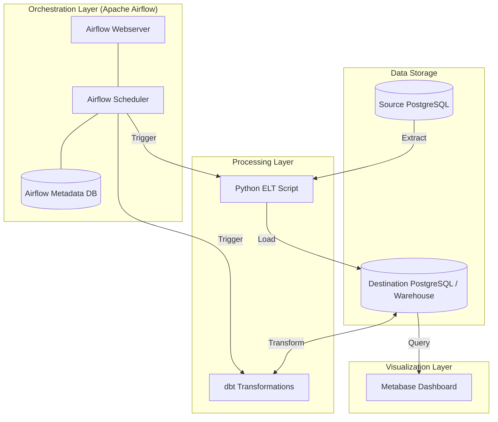

# Project Architecture: Custom ELT Pipeline

This project implements a robust ELT (Extract, Load, Transform) pipeline orchestrated by **Apache Airflow**. It moves data from a source PostgreSQL database to a destination PostgreSQL database (acting as a data warehouse), transforms the data using **dbt**, and visualizes it using **Metabase**.

## Architecture Diagram

## Key Components

### 1. Source Database (PostgreSQL)
- The origin of the raw data.
- Initialized with data from `source_db_init/init.sql`.

### 2. ELT Script (Python)
- **Extract**: Connects to the source database and extracts data.
- **Load**: Dumps the data into the destination database.
- Runs as a standalone container or triggered by Airflow.

### 3. Destination Database (PostgreSQL)
- Acts as the Central Data Warehouse.
- Stores both raw and transformed data.

### 4. dbt (Data Build Tool)
- Performs the **Transform** step.
- Runs SQL-based models inside the destination database to create clean, analytics-ready tables.
- Located in the `custom_postgres` directory.

### 5. Apache Airflow
- The **Orchestrator** that manages the timing and dependencies of the pipeline.
- Defined in `airflow/dags/elt_pipeline_dag.py`.
- Consists of a Webserver, Scheduler, and its own metadata database.

### 6. Metabase
- The **Visualization** layer.
- Connects to the destination database to provide dashboards and business intelligence.

## How it works
1. **Airflow** triggers the **ELT Script**.
2. The script copies data from **Source** to **Destination**.
3. **Airflow** then triggers **dbt** to transform the raw data in **Destination**.
4. **Metabase** pulls the transformed data for reporting.
